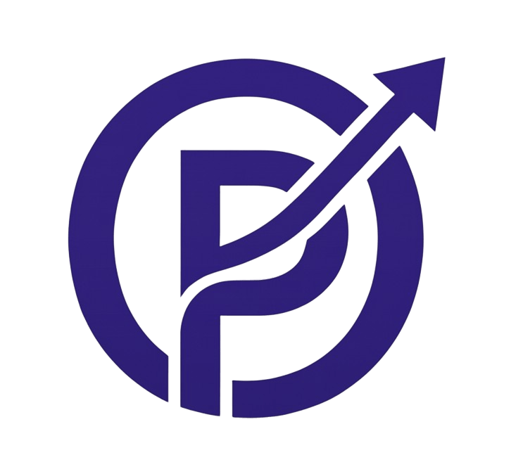

<div align="center">



**A free project planner that runs in the browser.**

Build a WBS, a Gantt chart, a critical-path network diagram, a resource plan and a budget without a paid licence.


</div>

---

## Table of contents

- [About](#about)
- [Features](#features)
- [Tech stack](#tech-stack)
- [Getting started](#getting-started)
- [Usage](#usage)
- [Project structure](#project-structure)
- [Contributing](#contributing)
- [Author](#author)
- [License](#license)

## About

OpenPlan is a project management tool for students and small teams who need to plan a project with the standard techniques (WBS, Gantt chart, critical path method, resource allocation and budgeting) but don't have access to paid desktop software.

It runs entirely in the browser and has no server or account. Projects are saved on your own computer.

## Features

- **Gantt chart**: an outline of summary tasks and subtasks, FS/SS/FF/SF links with lag, milestones, constraints, deadlines, split tasks and a timeline strip. You can drag bars to move tasks, resize them or link them.
- **Critical path**: forward and backward passes that give ES, EF, LS, LF, total slack and free slack.
- **Diagrams**: a network diagram (activity on node), a WBS chart and a team org chart. Each one exports to PNG or SVG.
- **Resources**: work, material and cost resources, calendars, vacations, rate changes, a workload heatmap and resource leveling.
- **Tracking**: baselines, % complete, actual dates, a status date and earned value (SPI, CPI, EAC).
- **Budget and reports**: cost by work package and by resource, monthly and cumulative cost, and 10 ready-made reports.
- **Files**: save to `.openplan` files, open them by double-clicking once the app is installed, import and export project XML, and export CSV.
- **Interface**: a tabbed toolbar that you can hide, keyboard shortcuts, undo and redo, and light and dark themes.

## Tech stack

| Layer | Technology |
|---|---|
| UI | React 18, TypeScript |
| State | Zustand |
| Build | Vite 6 |
| Scheduling and charts | Plain JavaScript modules rendering SVG (`src/core/`) |
| Storage | Browser localStorage, and the File System Access API for project files |

## Getting started

### Prerequisites

- [Node.js](https://nodejs.org) 18 or later

### Installation

```bash
git clone https://github.com/MNSBaanu/OpenPlan.git
cd OpenPlan
npm install
```

### Run in development

```bash
npm run dev        # http://localhost:5173
```

### Build for production

```bash
npm run build      # outputs to dist/
npm run preview    # serves dist/ at http://localhost:4173
```

### Deployment

`dist/` uses relative paths, so it can be hosted on any static host, such as GitHub Pages or Netlify. Opening `dist/index.html` directly from disk does not work in most browsers.

#### Vercel (automatic)

`.github/workflows/vercel.yml` deploys to [Vercel](https://vercel.com). Every push to `main` goes to production, and every pull request gets a preview URL.

One-time setup:

1. Create the Vercel project. Either import the repository at vercel.com/new, or run `npx vercel link` in the project folder.
2. Create a token at **vercel.com › Account Settings › Tokens**.
3. Find the IDs in `.vercel/project.json` (created by `vercel link`), or under **Project › Settings › General**.
4. In GitHub, go to **Settings › Secrets and variables › Actions** and add three repository secrets:
   - `VERCEL_TOKEN`: the token
   - `VERCEL_ORG_ID`: the `orgId`
   - `VERCEL_PROJECT_ID`: the `projectId`

If you imported the repository into Vercel, turn off Vercel's own Git deployments (**Project › Settings › Git**) so each push deploys only once.

### Visitor counts

OpenPlan counts visitors with [GoatCounter](https://www.goatcounter.com), a free analytics service that uses no cookies. The script tag is in `index.html`. It counts visits to the landing page (`/`) and to the app (`/app`) separately. Project data is never sent.

To use your own GoatCounter account, change `mnsbaanu` in the `data-goatcounter` address in `index.html` to your site code. GoatCounter ignores visits from `localhost`, so only the deployed site is counted.

## Usage

### Saving your work

- **Autosave**: every change is saved in the browser's localStorage. That copy exists only in the browser and computer you are using, and clearing your browser data deletes it.
- **Save** (Ctrl+S) writes an `.openplan` file. In Chrome and Edge, the first save asks where to put the file, and later saves write back to that same file. **Save As** makes a copy. Other browsers download the file instead.
- **Open** loads an `.openplan` file, an older `.json` project file or a project XML file.

Keep a project file for anything important.

### Opening files by double-clicking

In Chrome or Edge, install OpenPlan as an app. After that, double-clicking an `.openplan` file opens it in OpenPlan.

1. Open OpenPlan from an HTTPS address or from `localhost`.
2. Click the **Install** icon in the address bar, or choose **Cast, save and share › Install page as app** from the browser menu.
3. Double-click an `.openplan` file. The first time, choose **Allow** when the browser asks whether OpenPlan may open this file type.

### Toolbar

- The **Task**, **Resource**, **Report**, **Project** and **View** tabs each show a set of commands. **Format** appears when the Gantt chart is open.
- **File** opens the menu for new, open, save, export and print.
- **Hide toolbar** (or Ctrl+F1, or double-clicking a tab) collapses the toolbar to its tabs. While it is hidden, clicking a tab shows the commands over your work.

### Import and export

| Format | Support |
|---|---|
| Project XML (`.xml`) | Import and export |
| `.mpp` / `.pod` | Export the XML, then open it in a desktop project tool and use **Save As**. Browsers cannot write these binary formats. |
| CSV | Export the task list |
| PNG / SVG / PDF | Chart images, and printing to PDF |

### Keyboard shortcuts

| Keys | Action |
|---|---|
| Ctrl+S | Save |
| Ctrl+Z / Ctrl+Y | Undo / redo |
| Ctrl+F1 | Hide or show the toolbar |
| Alt+Shift+→ / ← | Indent or outdent the selected tasks |
| Insert | Insert a task |
| Delete | Delete the selected tasks |
| ↑ / ↓ | Move between rows while editing |

## Project structure

```
OpenPlan/
├── public/
│   ├── assets/              logo, favicon and app icons
│   └── manifest.webmanifest app install and .openplan file handling
├── src/
│   ├── core/                scheduling engine, XML/CSV import-export, SVG charts, sample project
│   ├── components/          toolbar, title and status bars, File menu, dialogs, task details panel
│   ├── views/               Gantt, diagrams, resource sheet, workload, budget, reports
│   ├── lib/                 task commands, grid columns and filters, file actions
│   ├── store.ts             app state, undo/redo, autosave
│   ├── App.tsx              layout and keyboard shortcuts
│   └── main.tsx             entry point
├── index.html
├── package.json
└── vite.config.ts
```

## Contributing

1. Fork the repository and create a branch: `git checkout -b feature/my-change`
2. Make your changes and check that `npm run build` passes.
3. Commit, push, and open a pull request.

## Author

OpenPlan is made by [MNS Baanu](https://github.com/MNSBaanu).

## License

OpenPlan is released under the [MIT License](LICENSE).
